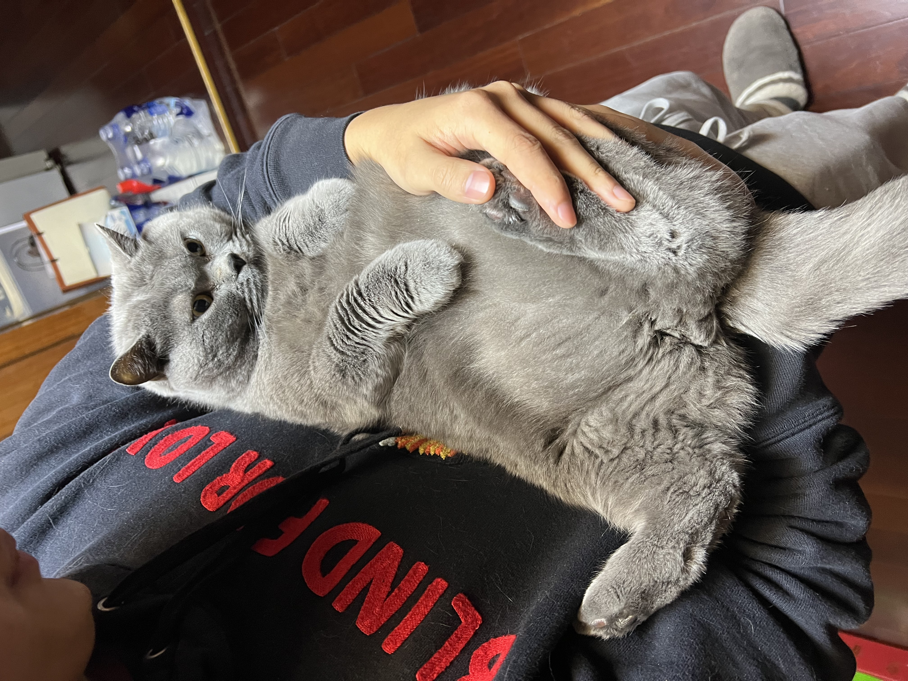

## This is Shaoyu Chen's website

Hi, welcome to my personal website! 

My name is Shaoyu Chen, and I am a the first year graduate student in MS Biostatistics program. Here you can find my academic and professional experience.

## My academic and professional experience

Here is my resume. you can check it: [resume](Resume_Shaoyu Chen.pdf)

## My personal information

Here is my pretty handsome cat. He is toooo fat. 

And I also love to play guitar. 

Moreover, below is my email, GitHub account, and instagram accout. You can also check them on the upper right corner.

* [github](https://github.com/ShaoyuChen0728)
* [instagram](https://www.instagram.com/jeychen2000/)
* email: sc5351@cumc.columbia.edu
